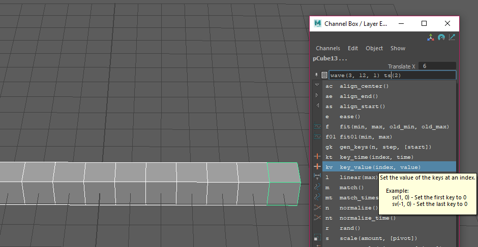

Dash+
=====

Dash+ extends Dash to add super powers to Maya's Channel Box. Using value
relative operators like "+=" and "\*=" feels great, but there is so much more
fun to be had.

New Super Powers
----------------

- Chain Dash commands!
- Use the New @command decorator to add your own commands directly from Python.
- Use Time operators to manipulate key times! +=:, -=:, \*=:, \\=:, %=:, ^=:
- Create and modify Expressions by using "=" like in the Attribute Editor.
- Execute Python code to modify values and keyframes by using ":".

Install Dash+
-------------
Place dashplus.py in your Maya's scripts directory.
Add the following to your userSetup.py.

.. code-block:: python

    import dashplus
    dashplus.install()

Use Dash+
---------
To bring up the Dash+ UI select some channels in your ChannelBox and then *alt + right* click on channel.

Dash Command Mode
-----------------
Dash is the default mode of the Dash+ UI. If you enter some text and press return, all commands will be
looked up in the Dash+ registry. You can also chain Dash commands by entering more than one separated by
spaces.

Examples
********
Use *wave* and *timeStep* to produce regular sine curves offset in time.

:code:`wave(3, 12, 1) ts(2)`

*wave* will generate a sine curve with keys every 12 frames then *ts* will offset each animation curve in steps of 2 frames. The keyframes wave produces are at the maximum and minimum values of a sine curve, to give ourselves a better rest state, let's use *key_value* to set the first and last keys values to 0.

:code:`kv(0, 0) kv(-1, 0)`

Clicking a command from the menu will insert the command at the end of your current input. Making it very easy to build up a chain of Dash commands.

Python Mode
-----------
By prefixing your input string with `:` Dash+ will evaluate the command using python. The resulting value
will be applied to the channels you have selected. Some useful variables are made available to you.

==========   =========================================
 Names        Description
==========   =========================================
 i            Object index
 t            Normalized object index (0 - 1)
 v            Current channel value
 j            Key index
 time         Current time or time of key
 c            Channel object with lots of juicy methods
 fit01        fit01(t, 10, 20) == 15
 cmds         Straight outta maya wham bam
 mel          maya.mel so you can use mel.eval
==========   =========================================

Also available are all registered Dash commands and all objects in the math and random modules.

Examples
********
Distribute values from -10 to 10:

:code:`:fit01(t, -10, 10)`

Jitter every other value using uniform:

:code:`:(i % 2) * uniform(5)`

Time Operators mode
-------------------
Time operators are just like relative value operators except that they operate on keyframe times rather
than channel values.

==========   =============================================
 Operator     Description
==========   =============================================
 +=:          Offset times in the positive direction
 -=:          Offset times in the negative direction
 \*=:          Multiply all times
 /=:          Divide all times
 %=:          Perform the Modulo operation on times
 ^=:          XOR time values
==========   =============================================

Expressions Mode
----------------
Expressions in Dash+ are super duper crazy. By providing additional variables, like we did with Python above
applying expressions to many objects at once can seem miraculous!

==========   =========================================
 Names        Description
==========   =========================================
 $this        This objects name. Use it like *$this.tx*.
 $i           Object index
 $t           Normalized object index (0 - 1)
 $v           Current channel value
 $c           Channel object with lots of juicy methods
 $fit01       $fit01($t, 10, 20) == 15
 $cmds        Straight outta maya wham bam
 $mel         maya.mel so you can use mel.eval
==========   =========================================

The trick here is that we're evaluating the variables in expressions using Python and then replacing them with the resulting values. This lets you create Expressions that vary between all the objects they are being
applied to.

Examples
********
From frames 24 to 36 have all object's values change from 0 to 180 stepped by 1 frame ($i):

:code:`=smoothstep(24, 36, frame + $i) * 180`

Produces a value change scaled by the normalized object index. Objects at the start of your
selection barely change, while objects at the end of the selection get the full effects of frame.

:code:`=$t * frame`

Add new dash commands
---------------------

Decorate a python function

.. code-block:: python

    import dashplus

    @dashplus.command('multiply', 'm')
    def multiply(*args):
        '''Multiply values by an amount.'''

        assert len(args) == 1, 'Expected 1 argument.'

        for i, t, channel in dashplus.channels():
            value = channel.get() * args[0]
            channel.set(value)

OR add a text command by hand

.. code-block:: python

    import dashplus
    dashplus.add_command(
        MayaExec='import random',
        MayaEval='random.choice',
        DashCommand='choice',
        ShortDashCommand='ch',
        Description='Randomly choose a value from a list.',
        Hint='([...])',
        Icon=':/chooser.svg'
    )

I think there's a lot of interesting workflows that can be developed around Dash+. Please email me if you
have any questions or requests.
